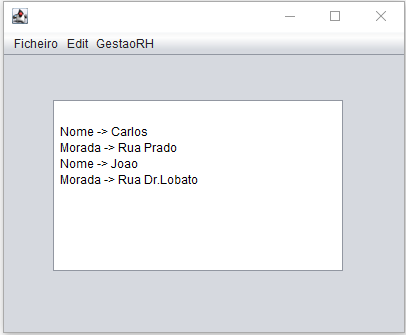
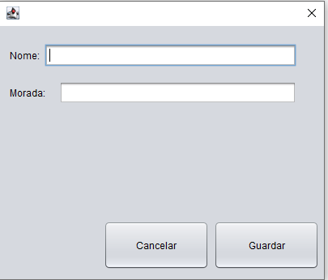

# 🏢 Gestão de Recursos Humanos

Projeto desktop desenvolvido em **Java Swing** para a gestão simplificada e listagem de colaboradores.

---

## 📸 Demonstração

| Janela Principal e Listagem | Formulário de Inserção |
| :---: | :---: |
|  |  |
| *Interface principal com listagem em JTextArea* | *Janela modal para entrada de novos dados* |

---

## 🚀 Funcionalidades

* **Menu GestaoRH**: Acesso rápido ao formulário de introdução de novos colaboradores.
* **Interface Dinâmica**: Atualização imediata da informação através de uma `JTextArea` dedicada.
* **Encapsulamento**: Gestão de dados robusta utilizando a classe `Pessoa` no pacote `dataModel`.
* **Segurança de Fecho**: Sistema de validação com diálogos de confirmação para evitar a saída acidental do programa.

## 📂 Estrutura Técnica

O projeto foi organizado para separar a interface da lógica de dados:

* **`uI.desktop`**: Contém a lógica visual e os componentes de interface (`FrmStarted` e `JDialogEditarPessoa`).
* **`dataModel`**: Contém a estrutura de dados e objetos de negócio (`Pessoa.java`).
* **Sem Dependências Externas**: Construído totalmente com bibliotecas nativas do ecossistema Java (**Swing/AWT**).

---
> 💡 **Nota:** Trabalho prático realizado no âmbito da formação de Programador Informático.
